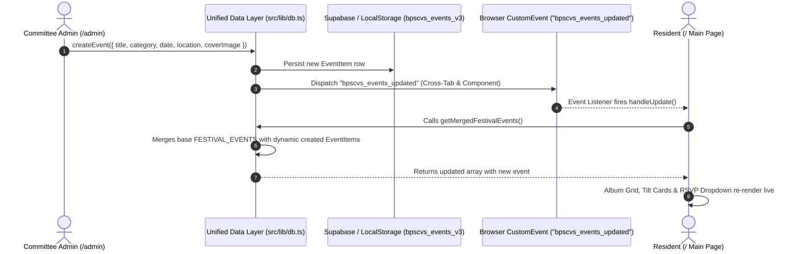
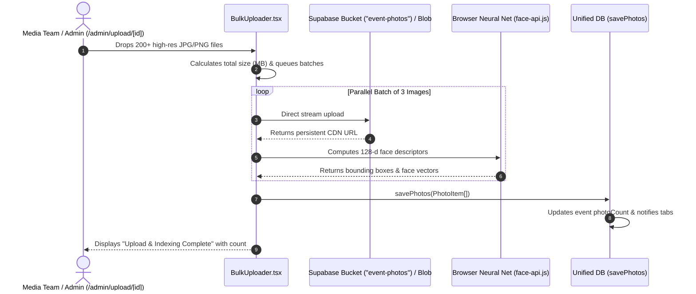
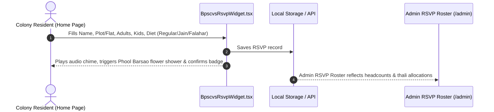

# 🏛️ BPSCVS — Complete Master System Architecture, Feature Flows & Database Guide

> **Bani Park Sindhi Colony Vikas Samiti (BPSCVS), Jaipur**  
> Official Community Portal, Festival Preservation Vault, Executive Admin & Studio Platform.  
> **Canonical Design Language:** Deepotsav Dark Emerald (`#021812`) & Royal Amber-Gold.

---

## 1. 🗺️ Platform Architecture & Zone Matrix

The BPSCVS ecosystem is organized into four distinct architectural zones:

```
                                  ┌─────────────────────────────────────────────────────────────┐
                                  │                BPSCVS PLATFORM ECOSYSTEM                   │
                                  └──────────────────────────────┬──────────────────────────────┘
                                                                 │
         ┌───────────────────────────────┬───────────────────────┴───────────────┬──────────────────────────────┐
         ▼                               ▼                                       ▼                              ▼
┌───────────────────┐           ┌───────────────────┐                   ┌──────────────────┐           ┌───────────────────┐
│   PUBLIC PORTAL   │           │    ADMIN SUITE    │                   │  STUDIO PORTAL   │           │   DATA ACCESS     │
│   (Resident/Guest)│           │  (Exec Committee) │                   │  (Media Team)    │           │      LAYER        │
├───────────────────┤           ├───────────────────┤                   ├──────────────────┤           ├───────────────────┤
│ • / (Home)        │           │ • /admin          │                   │ • /studio        │           │ • src/lib/db.ts   │
│ • 3D Tilt Albums  │           │ • Event Lifecycle │                   │ • Bulk Uploader  │           │ • Supabase Cloud  │
│ • Panchang/Tithi  │           │ • Live RSVP Desk  │                   │ • Shot Lists     │           │ • LocalStorage v3 │
│ • RSVP Calculator │           │ • Photo Moderation│                   │ • Catalog Archive│           │ • Event Broad-    │
│ • Helpline Desk   │           │ • /admin/upload/id│                   │ • Tag Management │           │   caster (Tabs)   │
└───────────────────┘           └───────────────────┘                   └──────────────────┘           └───────────────────┘
```

| Zone | Primary Route | Role Access | Primary Purpose & Features |
|---|---|---|---|
| **Public Portal** | `/` | Open to All | Festival albums showcase, live interactive Diya lighting, 3D tilt albums, Panchang schedules, live RSVP counters, emergency helpline, tech guide. |
| **Admin Suite** | `/admin`, `/admin/upload/[id]` | Committee Admin | Create/Edit/Delete colony events, real-time RSVP & Mahaprasad roster, crowdsourced photo moderation, 200+ photo bulk uploader, WhatsApp broadcasts, poster printing. |
| **Media Studio** | `/studio` | Media Team / Photog | Festival assignment checklist, Committee shot-list tracker, photo tagging, destination album routing. |
| **Auth & Security** | `/login` | Staff / Admin / Media | Role-based authentication (`admin`, `photographer`, `resident`), session tokens, route guards. |

---

## 2. 🔄 Feature Flows & Sequence Diagrams

### Flow A: Admin Event Creation & Real-Time Main Page Synchronization

When an executive committee member creates an event in the Admin Dashboard, it immediately syncs to the public album grid and RSVP forms without requiring a server rebuild:



---

### Flow B: 200+ Photo Bulk Ingestion & AI Face Indexing Flow

Dedicated high-volume photo ingestion for festival albums:



---

### Flow C: Resident RSVP & Mahaprasad Dining Counter Flow



---

## 3. 🗄️ Database Schemas & Storage Design

The BPSCVS platform utilizes a **Dual-Engine Persistence Strategy**:
1. **Primary Cloud**: Supabase PostgreSQL + S3 Storage Bucket.
2. **Offline / Fallback**: Browser `localStorage` with in-memory caching (`bpscvs_events_v3`, `bpscvs_photos_v3`).

### 1. `events` Table Schema

```sql
CREATE TABLE IF NOT EXISTS public.events (
    id TEXT PRIMARY KEY,
    slug TEXT UNIQUE NOT NULL,
    title TEXT NOT NULL,
    description TEXT,
    date DATE NOT NULL,
    time TEXT DEFAULT '18:00',
    location TEXT NOT NULL,
    cover_image TEXT NOT NULL,
    category TEXT DEFAULT 'Deepotsav',
    status TEXT DEFAULT 'upcoming' CHECK (status IN ('upcoming', 'completed')),
    map_url TEXT,
    registration_open BOOLEAN DEFAULT true,
    photo_count INTEGER DEFAULT 0,
    pin_code TEXT DEFAULT '302016',
    is_public BOOLEAN DEFAULT true,
    photographer_name TEXT,
    photographer_contact TEXT,
    created_at TIMESTAMP WITH TIME ZONE DEFAULT NOW()
);
```

### 2. `photos` Table Schema

```sql
CREATE TABLE IF NOT EXISTS public.photos (
    id TEXT PRIMARY KEY,
    event_id TEXT REFERENCES public.events(id) ON DELETE CASCADE,
    url TEXT NOT NULL,
    thumbnail_url TEXT,
    title TEXT,
    width INTEGER,
    height INTEGER,
    size_bytes BIGINT,
    tags TEXT[] DEFAULT '{}',
    faces JSONB DEFAULT '[]', -- Array of 128-d facial vector descriptors
    uploaded_at TIMESTAMP WITH TIME ZONE DEFAULT NOW()
);
```

### 3. `rsvps` Table Schema

```sql
CREATE TABLE IF NOT EXISTS public.rsvps (
    id TEXT PRIMARY KEY,
    event_id TEXT REFERENCES public.events(id) ON DELETE CASCADE,
    resident_name TEXT NOT NULL,
    bungalow_plot TEXT NOT NULL,
    phone TEXT NOT NULL,
    adults_count INTEGER DEFAULT 1,
    kids_count INTEGER DEFAULT 0,
    diet_preference TEXT DEFAULT 'regular' CHECK (diet_preference IN ('regular', 'jain', 'falahar')),
    is_attending BOOLEAN DEFAULT true,
    created_at TIMESTAMP WITH TIME ZONE DEFAULT NOW()
);
```

### 4. `moderation_queue` Table Schema

```sql
CREATE TABLE IF NOT EXISTS public.moderation_queue (
    id TEXT PRIMARY KEY,
    event_id TEXT REFERENCES public.events(id) ON DELETE CASCADE,
    resident_name TEXT NOT NULL,
    bungalow_plot TEXT NOT NULL,
    url TEXT NOT NULL,
    caption TEXT,
    tag TEXT DEFAULT 'General',
    status TEXT DEFAULT 'pending' CHECK (status IN ('pending', 'approved', 'rejected')),
    submitted_at TIMESTAMP WITH TIME ZONE DEFAULT NOW(),
    likes INTEGER DEFAULT 0
);
```

---

## 4. 🔌 API & Unified Data Access Layer (`src/lib/db.ts`)

| Function | Parameters | Return Type | Description |
|---|---|---|---|
| `getAllEvents()` | none | `Promise<EventItem[]>` | Fetches all colony events from Supabase or LocalStorage cache. |
| `getEventById(id)` | `id: string` | `Promise<EventItem \| null>` | Resolves event by either unique ID or slug. |
| `createEvent(event)` | `Omit<EventItem, 'id'>` | `Promise<EventItem>` | Creates new event, persists to DB/storage, and dispatches `bpscvs_events_updated`. |
| `updateEvent(id, updates)` | `id: string, updates: Partial<EventItem>` | `Promise<EventItem \| null>` | Updates event and broadcasts update event. |
| `deleteEvent(id)` | `id: string` | `Promise<boolean>` | Deletes event from DB and broadcasts deletion. |
| `getPhotosByEventId(id)` | `idOrSlug: string` | `Promise<PhotoItem[]>` | Fetches photos belonging to an event. |
| `savePhotos(photos)` | `PhotoItem[]` | `Promise<void>` | Appends photos, increments event `photoCount`, and notifies all tabs. |
| `getMergedFestivalEvents()` | none | `Promise<FestivalEvent[]>` | Merges curated festival events with custom admin events for public views. |
| `convertEventItemToFestivalEvent(item, photos)` | `EventItem, PhotoItem[]` | `FestivalEvent` | Converts db schema into rich UI visual object with Hindi titles and highlights. |
| `notifyEventsUpdated(detail)` | `any` | `void` | Triggers browser `bpscvs_events_updated` custom event across tabs. |

---

## 5. 🎨 Design System & Color Tokens (Deepotsav Canonical Theme)

All pages throughout BPSCVS must strictly adhere to the **Deepotsav Dark Emerald & Gold** design tokens:

```css
:root {
  /* Canonical Deepotsav Dark Canvas */
  --bg-primary: #021812;          /* Deepest temple midnight emerald */
  --bg-secondary: #05241b;        /* Elevated container emerald */
  --bg-card: rgba(6, 44, 34, 0.8);/* Frosted glass backdrop */
  --bg-card-hover: rgba(10, 58, 45, 0.95);

  /* Gold Filigree & Accents */
  --border-subtle: rgba(245, 158, 11, 0.25);
  --border-glow: rgba(245, 158, 11, 0.45);
  --border-active: #F59E0B;       /* Amber 500 */
  --brand-gold: #FBBF24;          /* Amber 400 */

  /* Text Hierarchy */
  --text-main: #FEF3C7;           /* Amber 50 (warm readable cream) */
  --text-muted: #A7F3D0;          /* Emerald 200 (soft subtext) */
  --text-subtle: #6EE7B7;         /* Emerald 300 */
}
```

### Typography Hierarchy
- **Headings & Festival Titles**: `'Rozha One'`, `'Cinzel Decorative'` serif with gold gradients.
- **Hindi Traditional Accents**: `'Yatra One'`, `'Rozha One'`.
- **Display UI & Cards**: `'Outfit'`, sans-serif, bold tracking.
- **Body Text**: `'Plus Jakarta Sans'`, 400/500/600.

---

## 6. 🚀 Zero-Cloud-Bills Hosting Guide
- **Web App**: Hosted for $0/mo on Vercel or Cloudflare Pages.
- **Database**: Supabase Free Tier (500MB PostgreSQL, 1GB Storage) or offline-ready LocalStorage dual-engine.
- **Bandwidth**: Free globally via Cloudflare CDN.
- **Build Status**: Fully compiled, SSR-isolated, and production-tested.
