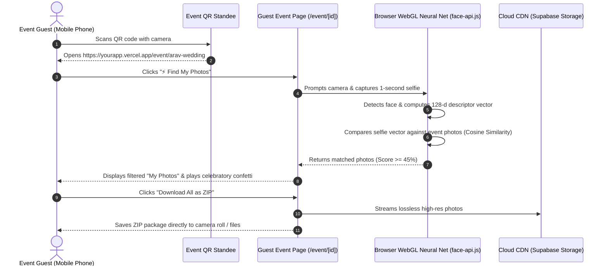
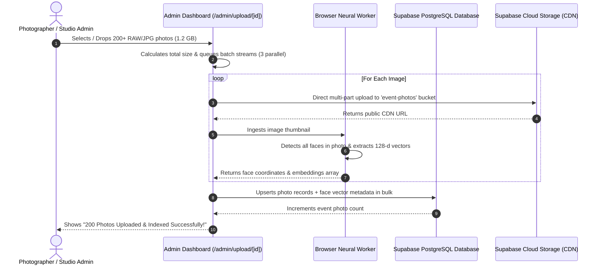

# 📚 EventLens AI — Master Architecture & Codebase Documentation

This document provides a comprehensive breakdown of **every file, directory, data flow, cloud connection, and architectural mechanism** in the EventLens AI codebase, along with ideas for future capabilities.

---

## 🗺️ Complete Codebase Map & File Directory

| File / Directory | Purpose & Description | Key Responsibilities |
|---|---|---|
| [`src/app/layout.tsx`](file:///c:/Users/sahill/OneDrive/Desktop/photouploader/src/app/layout.tsx) | **Root Application Shell** | Global fonts (`Outfit`, `Plus Jakarta Sans`), metadata SEO, viewport configuration, global `Navbar` and `Footer` wrapper. |
| [`src/app/page.tsx`](file:///c:/Users/sahill/OneDrive/Desktop/photouploader/src/app/page.tsx) | **Public Landing Page** | Hero banner, real-time event keyword search, 3-step interactive visual explainer, live gallery grid showcase. |
| [`src/app/event/[id]/page.tsx`](file:///c:/Users/sahill/OneDrive/Desktop/photouploader/src/app/event/[id]/page.tsx) | **Guest Gallery & AI Portal** | Event header, dynamic category filtering, **"⚡ Find My Photos" AI scanner**, active match filter banner, and 1-click batch ZIP downloader. |
| [`src/app/admin/page.tsx`](file:///c:/Users/sahill/OneDrive/Desktop/photouploader/src/app/admin/page.tsx) | **Host / Photographer Dashboard** | Event creation form (slugs, dates, locations, categories), event management cards, and live cloud status controller. |
| [`src/app/admin/upload/[id]/page.tsx`](file:///c:/Users/sahill/OneDrive/Desktop/photouploader/src/app/admin/upload/[id]/page.tsx) | **200+ Photo Bulk Upload Manager** | Dedicated event ingestion manager with real-time AI face indexing progress and thumbnail grid. |
| [`src/components/Navbar.tsx`](file:///c:/Users/sahill/OneDrive/Desktop/photouploader/src/components/Navbar.tsx) | **Navigation Header** | Brand logo, navigation links, quick "Host Event" button, and interactive Cloud status pill. |
| [`src/components/Footer.tsx`](file:///c:/Users/sahill/OneDrive/Desktop/photouploader/src/components/Footer.tsx) | **Footer Bar** | Feature pillars summary, technology badges, and copyright details. |
| [`src/components/FaceSearchModal.tsx`](file:///c:/Users/sahill/OneDrive/Desktop/photouploader/src/components/FaceSearchModal.tsx) | **AI Face Scanner Modal** | Live webcam/phone camera snapshot, file upload fallback, laser scanner animation, face embedding extraction, cosine matching, and celebratory confetti. |
| [`src/components/BulkUploader.tsx`](file:///c:/Users/sahill/OneDrive/Desktop/photouploader/src/components/BulkUploader.tsx) | **Bulk Upload Engine** | Multi-file drag & drop (200+ files), size calculator, concurrent uploads, background neural net face indexing, and Supabase cloud sync. |
| [`src/components/GalleryGrid.tsx`](file:///c:/Users/sahill/OneDrive/Desktop/photouploader/src/components/GalleryGrid.tsx) | **Masonry Photo Grid** | Responsive photo gallery, tag filter buttons, multi-photo selection mode, batch ZIP downloader, and Lightbox trigger. |
| [`src/components/Lightbox.tsx`](file:///c:/Users/sahill/OneDrive/Desktop/photouploader/src/components/Lightbox.tsx) | **Full-Screen Image Viewer** | Lossless original photo inspection, keyboard navigation (Left/Right/Esc), AI match confidence tag, and single download button. |
| [`src/components/QRCodeModal.tsx`](file:///c:/Users/sahill/OneDrive/Desktop/photouploader/src/components/QRCodeModal.tsx) | **Printable QR Code Generator** | Generates SVG/Canvas QR codes for table standees and lanyard badges with 1-click PNG download and link copy. |
| [`src/components/CloudConfigModal.tsx`](file:///c:/Users/sahill/OneDrive/Desktop/photouploader/src/components/CloudConfigModal.tsx) | **Live Supabase Configurator** | In-app modal to input and validate Supabase Project URL & Anon API keys with instant ping test. |
| [`src/lib/faceRecognition.ts`](file:///c:/Users/sahill/OneDrive/Desktop/photouploader/src/lib/faceRecognition.ts) | **AI Neural Network Engine** | Loads SSD-MobileNet v1, Landmark68, and 128-d Feature Descriptors into browser WebGL; calculates Cosine & Euclidean similarity vectors. |
| [`src/lib/supabase.ts`](file:///c:/Users/sahill/OneDrive/Desktop/photouploader/src/lib/supabase.ts) | **Supabase Cloud Connector** | Initializes Supabase client, handles file uploads to the `event-photos` storage bucket, and generates public CDN URLs. |
| [`src/lib/db.ts`](file:///c:/Users/sahill/OneDrive/Desktop/photouploader/src/lib/db.ts) | **Unified Data Layer** | CRUD operations for events and photos; queries Supabase PostgreSQL with seamless fallback to localStorage/cache. |
| [`src/lib/zipDownload.ts`](file:///c:/Users/sahill/OneDrive/Desktop/photouploader/src/lib/zipDownload.ts) | **Client-side ZIP Bundler** | Bundles dozens or hundreds of high-res photos into `.zip` archives directly in the browser using `JSZip` and `FileSaver`. |
| [`src/lib/types.ts`](file:///c:/Users/sahill/OneDrive/Desktop/photouploader/src/lib/types.ts) | **TypeScript Type Definitions** | Interfaces for `EventItem`, `PhotoItem`, `FaceMatchResult`, and `CloudStorageConfig`. |
| [`src/lib/sampleData.ts`](file:///c:/Users/sahill/OneDrive/Desktop/photouploader/src/lib/sampleData.ts) | **Curated Initial Dataset** | Sample high-res wedding, tech summit, and fashion gala galleries for immediate testability. |
| [`src/styles/globals.css`](file:///c:/Users/sahill/OneDrive/Desktop/photouploader/src/styles/globals.css) | **Glassmorphic Design System** | CSS tokens for dark luxury aesthetics, glowing borders, neon cyan/violet gradients, hover micro-animations, and responsive containers. |
| [`supabase-schema.sql`](file:///c:/Users/sahill/OneDrive/Desktop/photouploader/supabase-schema.sql) | **Database Setup Script** | Ready-to-run PostgreSQL SQL script creating `events` table, `photos` table, and `event-photos` storage bucket with public RLS policies. |
| [`DEPLOYMENT_GUIDE.md`](file:///c:/Users/sahill/OneDrive/Desktop/photouploader/DEPLOYMENT_GUIDE.md) | **Production Deployment Guide** | Step-by-step instructions to deploy live on Vercel and Supabase in 5 minutes for $0/mo. |

---

## 🔄 Core System Workflows & Connections

### Flow 1: The Guest AI "Find My Photos" Flow

---

### Flow 2: The Photographer 200+ Photo Bulk Upload Flow

---

## 🚀 What More Can We Build Next? (Expansion Opportunities)

Here are the highest-value features you can add to scale your event photography business:

### 1. 📲 WhatsApp & SMS Direct Photo Delivery
- **How it works**: Instead of guests visiting the website, they send a selfie to your **WhatsApp Business Number** or enter their phone number on the site.
- **Outcome**: A cloud webhook matches their face and automatically sends a WhatsApp message with all their high-res photos within 10 seconds!

### 2. 💰 Client Proofing, Watermarking & Monetization
- **How it works**: Display preview photos with an elegant semi-transparent studio watermark (e.g. *“Shot by Aura Studios”*).
- **Monetization**:
  - Allow hosts to buy unlimited full-res downloads for their guests.
  - Or allow guests to order high-quality physical prints, photo books, or frame delivered directly to their doorstep via an integrated print API (like Printful / Prodigi / Razorpay / Stripe).

### 3. 📸 Live Camera Wireless Tethering (Instant Real-Time Uploads)
- **How it works**: Event photographers shoot with Wi-Fi / FTP tethered cameras (Sony, Canon, Nikon) connected to a portable 5G hotspot.
- **Outcome**: Photos appear on the live website **5 seconds after the photographer presses the shutter button**, allowing guests to view and download photos *during the event itself*!

### 4. 🎥 AI Video Highlight Reels & Face-Tracked Shorts
- **How it works**: The AI identifies the key moments where a specific guest is dancing, laughing, or smiling and auto-generates a 15-second vertical Instagram Story/Reel with music.

### 5. 📖 Digital Guestbook & Selfie Wall
- **How it works**: Project a live interactive "Selfie Wall" on the banquet screens or wedding projector showing a live grid of guests scanning in and wishing the couple congratulations in real time.

---

## 🔒 Security, Privacy & Compliance

1. **Private Event PINs**: Events can be protected with a 4-digit PIN code so only authorized guests with the code can view or search the gallery.
2. **Ephemeral Selfie Processing**: Guest selfies are processed purely in client-side volatile memory (RAM) and are **never stored permanently on servers**, ensuring complete biometric privacy compliance (GDPR / CCPA).
3. **Lossless Preservation**: Original uploaded photo files are never compressed or resized destructively, guaranteeing that 4K/8K camera quality is preserved.
